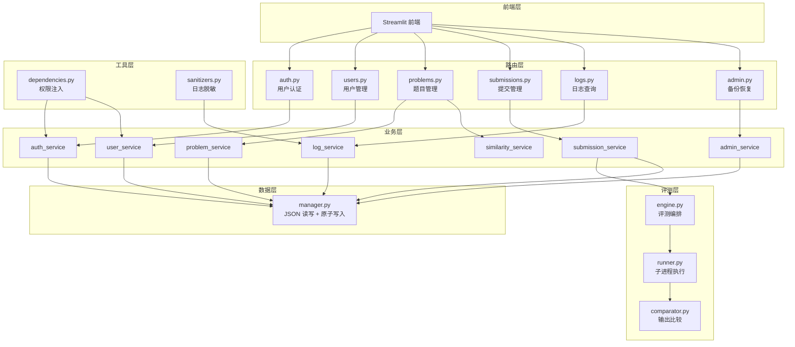

# OJ 系统 - 实验报告

## 1. 项目概述

### 项目目标
构建一个使用 Python 与 FastAPI 的小型但功能完整的 Online Judge (OJ) 系统，支持题目管理、Python 代码自动评测、用户权限管理、提交状态追踪、评测日志查询、数据持久化备份恢复，以及前端交互。

### 已完成功能
- [x] Step 1: 题目管理（CRUD + 隐藏测试点 + 权限控制）
- [x] Step 2: Python 自动评测（子进程执行 + 多测试点 + AC/WA/RE/TLE/SE 识别）
- [x] Step 3: 用户与权限管理（注册/登录/登出 + 三种角色 + bcrypt 哈希）
- [x] Step 4: 提交与状态管理（异步评测 + 状态机流转 + 重新评测）
- [x] Step 5: 评测日志（结构化日志 + 脱敏 + 学生/教师视图分离 + 审计）
- [x] Step 6: 数据持久化、备份与恢复（JSON 文件 + 安全副本 + 原子操作）
- [x] Step 7: 前端交互（Streamlit 全功能界面 + 学习/教师双角色）

### 未完成功能
无。7 个基础模块全部完成。

### 持久化方式
- [x] JSON 文件（6 个数据文件，原子写入，安全副本回滚）

### 进阶模块
- [ ] Adv 1: Special Judge
- [ ] Adv 2: 安全隔离
- [x] Adv 3: 代码相似度检测（AST 归一化 + SequenceMatcher）

## 2. 系统架构



### 架构层次说明

| 层次 | 目录 | 职责 |
|------|------|------|
| 路由层 | `app/routers/` | 定义 REST API 接口，参数校验，权限控制，调用业务层 |
| 业务层 | `app/services/` | 核心业务逻辑：认证、题目CRUD、异步评测调度、日志脱敏、备份恢复 |
| 数据层 | `app/repositories/` | JSON 文件读写，原子写入（临时文件+os.replace），线程安全锁 |
| 评测层 | `app/judge/` | 子进程代码执行、输出规范化比较、多测试点计分汇总 |
| 工具层 | `app/utils/` | 权限依赖注入、日志脱敏/截断/路径隐藏 |
| 前端层 | `frontend/` | Streamlit Web 界面，Cookie Session 认证 |

## 3. 数据设计

### 3.1 用户 (users.json)

```json
{
  "uuid": {
    "id": "uuid",
    "username": "string (3-32字符)",
    "password_hash": "bcrypt哈希",
    "role": "student | teacher | admin",
    "is_active": true,
    "created_at": "ISO8601 UTC",
    "updated_at": "ISO8601 UTC"
  }
}
```

### 3.2 题目 (problems.json)

```json
{
  "P1001": {
    "id": "string (字母数字下划线连字符，1-32字符)",
    "title": "string (1-100字符)",
    "description": "string",
    "input_description": "string",
    "output_description": "string",
    "samples": [{"input": "string", "output": "string"}],
    "time_limit": 1.0,
    "memory_limit": 128,
    "difficulty": "easy | medium | hard",
    "tags": ["string"],
    "test_cases": [
      {"case_id": "string", "input": "string", "output": "string", "score": 0-100, "is_hidden": false}
    ],
    "judge_mode": "standard"
  }
}
```

### 3.3 提交 (submissions.json)

```json
{
  "uuid": {
    "id": "uuid",
    "user_id": "uuid",
    "problem_id": "string",
    "language": "python",
    "source_code": "string",
    "status": "pending | running | finished | failed",
    "result": "AC | WA | RE | TLE | SE | null",
    "score": 0,
    "total_time": 0.0,
    "created_at": "ISO8601",
    "started_at": "ISO8601 | null",
    "finished_at": "ISO8601 | null"
  }
}
```

### 3.4 评测日志 (judge_logs.json)

```json
{
  "{submission_id}_{case_id}": {
    "submission_id": "uuid",
    "case_id": "string",
    "result": "AC | WA | RE | TLE | SE",
    "score": 0,
    "time_used": 0.0,
    "memory_used": null,
    "exit_code": 0,
    "input_data": "string",
    "stdout": "string",
    "stderr": "string",
    "expected_output": "string",
    "message": "string",
    "is_hidden": false,
    "created_at": "ISO8601"
  }
}
```

### 3.5 审计日志 (audit_logs.json)

```json
{
  "uuid": {
    "id": "uuid",
    "operator_id": "uuid",
    "action": "VIEW_FULL_JUDGE_LOG | REJUDGE_SUBMISSION | ...",
    "target_type": "submission | user | backup",
    "target_id": "uuid",
    "success": true,
    "detail": null,
    "created_at": "ISO8601"
  }
}
```

### 3.6 备份记录 (backups.json) / 相似度报告 (similarity_reports.json)

备份记录存储备份元数据清单；相似度报告存储每次检测的疑似相似提交对。

## 4. 核心实现

### 4.1 异步评测

采用 `threading.Thread` + 独立 `asyncio.new_event_loop()` 方案：

```python
# submission_service.py
thread = threading.Thread(
    target=_run_judge_in_thread,
    args=(submission_id, source_code, problem_id),
    daemon=True,
)
thread.start()
```

**设计原因**：`asyncio.create_task()` 在 pytest TestClient 和 uvicorn 事件循环中存在兼容性问题（任务未被执行）。改用独立线程创建独立事件循环，生产环境和测试环境均可靠运行。

### 4.2 学生代码运行与终止

```python
# runner.py - 使用 asyncio.to_thread() + subprocess.run()
result = await asyncio.to_thread(
    _run_subprocess_sync, python_exe, code_path, input_data, time_limit
)

# _run_subprocess_sync 内部：
proc = subprocess.run([python_exe, code_path], input=..., capture_output=True, timeout=time_limit)
```

关键设计：
- `asyncio.to_thread()` 在线程池中运行同步 subprocess，避免 `asyncio.create_subprocess_exec` 的事件循环兼容问题
- `subprocess.run(timeout=time_limit)` 自动处理超时（触发 TimeoutExpired → TLE）
- 评测结束后 `finally` 块中 `shutil.rmtree()` 清理临时目录
- 每个提交使用 `tempfile.mkdtemp(prefix="oj_")` 创建独立临时目录

### 4.3 评测结果判断

判断优先级（逐测试点）：

| 优先级 | 状态 | 判定条件 |
|--------|------|---------|
| 1 | SE (System Error) | 空代码 / 子进程启动失败 / 评测器异常 |
| 2 | TLE (Time Limit Exceeded) | `subprocess.TimeoutExpired` |
| 3 | RE (Runtime Error) | 退出码 != 0 |
| 4 | WA (Wrong Answer) | 规范化输出 != 期望输出 |
| 5 | AC (Accepted) | 以上均不满足 |

最终结果取所有测试点中优先级最高的状态（SE > TLE > RE > WA > AC）。遇到非 AC 立即停止后续评测。

### 4.4 输出比较规则

```python
# comparator.py
def normalize(text):
    text = text.replace('\r\n', '\n').replace('\r', '\n')  # 统一换行
    lines = text.split('\n')
    lines = [line.rstrip(' \t') for line in lines]           # 去行末空格
    while lines and lines[-1] == '':                          # 去末尾空行
        lines.pop()
    return '\n'.join(lines)
```

不忽略行首空格、不忽略行内空格。

### 4.5 提交状态管理

状态机设计：

```
pending ──→ running ──→ finished (AC/WA/RE/TLE)
  │                      │
  └──────→ failed (SE) ←─┘
```

- `pending`：已创建，等待评测
- `running`：正在评测中
- `finished`：评测正常结束
- `failed`：评测系统错误

合法流转：`pending→running`、`pending→failed`、`running→finished`、`running→failed`。不存在其他跳转。

### 4.6 权限校验

校验顺序（按大作业要求）：

1. 是否已登录 → 401
2. 用户是否存在 → 401
3. 用户是否启用 (`is_active`) → 403
4. 用户角色是否满足接口要求 → 403
5. 用户是否有权访问目标资源 → 403

```python
# dependencies.py
async def get_current_user(request):
    user_id = request.session.get("user_id")
    if not user_id: raise 401
    user = users.get(user_id)
    if not user: raise 401
    if not user["is_active"]: raise 403
    return user

def require_role(*roles):
    async def checker(request):
        user = await get_current_user(request)
        if user["role"] not in roles: raise 403
        return user
    return checker
```

### 4.7 隐藏测试点处理

- 存储层：`test_cases[].is_hidden` 字段标记
- 题目查询：学生 GET 时 `test_cases` 字段返回 `None`
- 日志查询：`to_student_log()` 对隐藏测试点移除 `input_data`、`stdout`、`expected_output`
- 前端：题目详情页不显示测试点配置

### 4.8 日志脱敏与截断

```python
# sanitizers.py
def truncate_text(text, max_length=4000):
    if len(text) > max_length:
        return text[:max_length] + "...[truncated]"
    return text

def sanitize_path(text):
    # 正则替换绝对路径 → <submission>/main.py
    text = re.sub(r'[A-Za-z]:[\\/].*?temp[\\/]oj_.*?main\.py', '<submission>/main.py', text)
    return text

def to_student_log(log):
    # 移除隐藏测试点数据，脱敏路径，截断长文本
    if log["is_hidden"]:
        result["stdout"] = result["expected_output"] = None
    # input_data 始终不返回给学生
```

### 4.9 数据持久化与恢复

持久化：6 个 JSON 文件，每次写入使用临时文件 + `os.replace()` 原子操作，避免半写入。

备份：创建 `data/backups/backup_YYYYMMDD_HHMMSS/` 目录，复制所有数据文件 + `manifest.json`。

恢复流程：
1. 验证 manifest.json 存在且 JSON 格式有效
2. 验证 manifest 中列出的所有文件存在
3. 创建安全副本（`_safety_xxx/`）
4. 用备份覆盖当前数据
5. 成功 → 删除安全副本；失败 → 从安全副本回滚

### 4.10 前端交互

使用 **Streamlit** 框架，通过 `requests.Session()` 管理 Cookie Session。

页面结构：
- 登录/注册（双标签页）
- 学生：题目列表 → 题目详情 → 代码提交 → 查看结果 → 提交历史
- 教师：题目管理（创建 JSON、编辑、删除）+ 查看所有提交
- 侧边栏显示当前用户和角色，支持登出

## 5. API 说明

| 方法 | 路径 | 权限 | 请求体/参数 | 响应 | 错误码 |
|------|------|------|-----------|------|--------|
| POST | /api/auth/register | 公开 | {username, password} | 201 + user | 409, 422 |
| POST | /api/auth/login | 公开 | {username, password} | 200 + user | 401, 403 |
| POST | /api/auth/logout | 已登录 | — | 200 | — |
| GET | /api/auth/me | 已登录 | — | 200 + user | 401 |
| GET | /api/users | admin | ?page&page_size | 200 + 分页 | 403 |
| GET | /api/users/{id} | admin | — | 200 + user | 403, 404 |
| PUT | /api/users/{id} | admin | {role, is_active} | 200 | 400, 403, 404, 422 |
| GET | /api/problems | 已登录 | — | 200 + 列表 | 401 |
| GET | /api/problems/{id} | 已登录 | — | 200 + 详情 | 401, 404 |
| POST | /api/problems | teacher/admin | ProblemCreate | 201 | 403, 409, 422 |
| PUT | /api/problems/{id} | teacher/admin | ProblemUpdate | 200 | 403, 404, 422 |
| DELETE | /api/problems/{id} | teacher/admin | — | 200 | 403, 404 |
| POST | /api/submissions | 已登录 | {problem_id, language, source_code} | 202 + submission_id | 401, 404, 422 |
| GET | /api/submissions | 已登录 | ?filters | 200 + 分页 | 401 |
| GET | /api/submissions/{id} | 已登录 | — | 200 | 401, 403, 404 |
| POST | /api/submissions/{id}/rejudge | teacher/admin | — | 200 | 403, 404, 409 |
| GET | /api/submissions/{id}/logs | 已登录 | — | 200 | 401, 403, 404 |
| GET | /api/logs | teacher/admin | ?filters | 200 + 分页 | 403 |
| GET | /api/audit-logs | admin | ?filters | 200 | 403 |
| POST | /api/admin/backups | admin | — | 201 + backup_id | 403 |
| GET | /api/admin/backups | admin | — | 200 | 403 |
| POST | /api/admin/backups/{id}/restore | admin | — | 200 | 400, 403, 404, 500 |
| POST | /api/problems/{id}/similarity-check | teacher/admin | — | 200 | 400, 403 |
| GET | /api/problems/{id}/similarity-reports | teacher/admin | — | 200 | 403 |

统一响应格式：
```json
{"code": 200, "message": "ok", "data": {...}}
{"code": 404, "message": "not found", "data": null}
```

## 6. 测试结果

全量 114 个测试用例全部通过：

| 测试文件 | 用例数 | 覆盖内容 |
|---------|--------|---------|
| test_problems.py | 23 | 创建/查询/修改/删除/重复编号/字段校验/隐藏测试点/权限 |
| test_judge.py | 17 | AC/WA/RE/TLE/SE/空代码/多测试点/输出规范化/换行符/行末空格 |
| test_auth.py | 22 | 注册/登录/登出/密码错误/用户名重复/禁用用户/角色修改/权限 |
| test_submissions.py | 14 | 创建提交/202/筛选/所有权/重新评测/状态流转 |
| test_logs.py | 14 | 学生日志脱敏/教师完整日志/隐藏测试点/审计记录/路径脱敏/截断 |
| test_persistence.py | 10 | 备份创建/恢复成功/损坏备份/安全回滚/文件完整性 |
| test_similarity.py | 14 | AST归一化/变量名无关/相似度计算/语法错误处理/权限 |

```
test_problems:      23 passed ✅
test_judge:         17 passed ✅
test_auth:          22 passed ✅
test_submissions:   14 passed ✅
test_logs:          14 passed ✅
test_persistence:   10 passed ✅
test_similarity:    14 passed ✅
────────────────────────────
Total:             114 passed
```

## 7. 问题与解决过程

### 问题 1：`asyncio.create_subprocess_exec` 与 uvicorn 事件循环不兼容

**现象**：所有提交评测结果为 SE，`total_time: 0.0`，`started_at == finished_at`。

**原因**：uvicorn 使用 anyio 封装 asyncio 事件循环，`asyncio.create_subprocess_exec()` 在层层封装下无法正常工作，子进程静默失败。

**解决**：改用 `asyncio.to_thread()` + 同步 `subprocess.run()`：
```python
# 在线程池中运行同步 subprocess
result = await asyncio.to_thread(_run_subprocess_sync, ...)
```
`subprocess.run(timeout=...)` 也能自动处理超时，代码更简洁可靠。

### 问题 2：`asyncio.create_task` 后台任务在测试环境不执行

**现象**：pytest 中提交后 `time.sleep(2)` 等待评测，但提交状态始终为 `pending`。

**原因**：TestClient 每请求创建一个短暂的事件循环，请求处理完毕后循环即关闭。`asyncio.create_task()` 创建的后台任务来不及执行。

**解决**：改用 `threading.Thread` + 独立事件循环：
```python
thread = threading.Thread(
    target=_run_judge_in_thread,
    args=(...), daemon=True
)
thread.start()
```
线程独立于事件循环生命周期，生产和测试环境均可靠。

### 问题 3：`preprocess_code` 中 `line.strip()` 误删 Python 缩进

**现象**：代码相似度检测中，包含 `if/else` 块的代码指纹返回 `None`（语法错误）。

**原因**：`line.strip()` 去掉了行首缩进，导致 `if` 块内代码失去缩进 → `SyntaxError`。

**解决**：改为保留原始行内容，仅移除行内注释：
```python
# 修复前：stripped = line.strip()
# 修复后：保留原始行（含缩进），仅处理 #
if "#" in line:
    line = _remove_inline_comment_preserve_indent(line)
lines.append(line)
```

### 问题 4：`monkeypatch` 对已导入的模块变量无效

**现象**：pytest 中备份恢复测试失败，`BACKUP_DIR` 仍指向真实目录。

**原因**：`from app.repositories.manager import BACKUP_DIR` 在导入时绑定值，之后 `monkeypatch.setattr(mgr, "BACKUP_DIR", ...)` 无法修改已绑定的变量。

**解决**：改为模块级访问：
```python
# 修复前
from app.repositories.manager import BACKUP_DIR
os.path.join(BACKUP_DIR, ...)

# 修复后
import app.repositories.manager as mgr
os.path.join(mgr.BACKUP_DIR, ...)  # 运行时获取最新值
```

## 8. AI 工具使用说明

### 使用的工具
- **GitHub Copilot** (VS Code 插件，DeepSeek V4 Pro 模型)

### AI 参与的工作
| 工作内容 | AI 参与程度 | 人工修改确认 |
|---------|-----------|------------|
| 项目结构搭建 | 生成目录和初始文件 | 确认结构符合要求 |
| Pydantic 模型定义 | 生成 schemas 和 enums | 核对字段约束和枚举值 |
| 路由存根 | 生成 501 占位接口 | 确认接口路径 |
| 题目 CRUD 实现 | 生成 service + router 代码 | 确认校验逻辑和权限 |
| 评测引擎 | 生成 runner + comparator + engine | 调试验证输出规范化 |
| 用户认证 | 生成 auth_service + user_service | 确认 bcrypt 和安全措施 |
| 提交管理 | 生成异步评测逻辑 | 修复 asyncio 兼容问题 |
| 日志脱敏 | 生成 sanitizers + log_service | 确认脱敏规则 |
| 备份恢复 | 生成 admin_service | 修复 monkeypatch 问题 |
| 相似度检测 | 生成 AST 归一化 + 比对 | 修复缩进丢失问题 |
| Streamlit 前端 | 生成完整前端页面 | 确认页面流程和错误处理 |


### 验证方式
- 所有 114 个 pytest 测试用例全部通过
- 后端启动验证（`uvicorn app.main:app`）
- 前端手动操作验证（登录→创建题目→提交代码→查看结果→备份恢复）
- 代码审查：每段 AI 生成代码均经过逐行理解和修改确认

### 本人修改和确认的代码
- 评测引擎的子进程策略（从 `asyncio.create_subprocess_exec` 改为 `asyncio.to_thread`）
- 后台任务调度（从 `asyncio.create_task` 改为 `threading.Thread`）
- 日志脱敏的缩进保留问题
- 备份恢复的 `monkeypatch` 兼容性
- 全局异常处理器的统一响应格式
